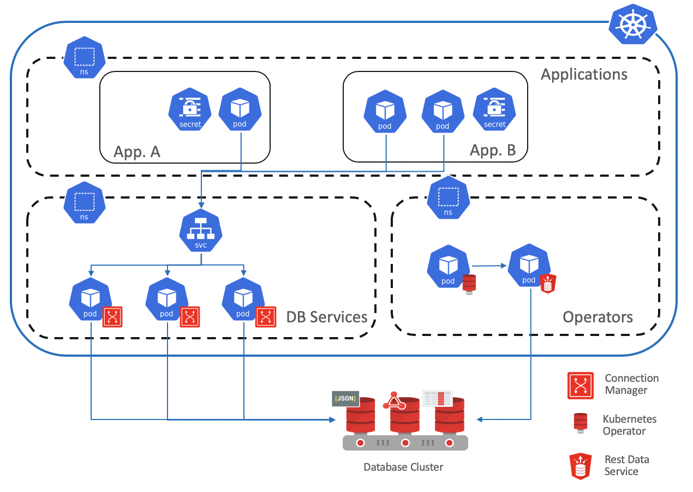

# Oracle DB Operator

The operator allows a seamless integration between an application deployed inside the kubernetes cluster and
an oracle database.

Using the REST database interface to provisioning new database containers, a PDB, or even cloning 
existing one. Allows to use any Oracle Database with multitenant option in a DBaaS fashion in any 
environment (cloud, on-prem or hybrid)

The complexity of managing the connections to the database is abstracted by the usage
of the Oracle Connection Manager so to have a "standard" kubernetes developer experience.

The operator creates a secret containing all the info for the connection, the visibility of
 which can be limited to the application itself so to achieve isolation of credentials.

A full architecture could be the one presented in this diagram:



# Requirements

## Oracle Connection Manager

Even if this is optional, when integrated can simplify the connection management and manage directly
 the advanced failover capabilities.
 
You can build your own version of CMAN v19.3 using the scripts here:

https://github.com/oracle/docker-images/tree/master/OracleDatabase/RAC/OracleConnectionManager

Once builded and uploaded to your private docker registry you can deploy CMAN on kubernetes
via a deployment script similar to the one in examples/ords-deployment.yaml

## Oracle Database
You can install any Oracle Enterprise edition that support multitenant even if version greater than 19.3 is suggested.
For semplicity you can also install database inside the kubernetes cluster following the docker creation script here:
https://github.com/oracle/docker-images/tree/master/OracleDatabase

Once you have the docker container you can configure the password in the configuration files in examples/database/configmaps (it 
automatically configure the db to register to CMAN) and inside the examples/database/oracle-db-deployment.yaml file,
 and then you can deploy the database into the cluster with:

```bash
kubectl create configmap oracle-db-config --from-file=./examples/database/configmaps/
kubectl apply -f examples/database/oracle-db-deployment.yaml

```
 


## Oracle Rest Data Services

ORDS is used to interface via REST for the management of the lifecycle of the database, you can 
build the ORDS v19.2 container following the steps here:

https://github.com/malagoli/docker-images/tree/master/OracleRestDataServices

Once builded and uploaded to your private docker registry you can deploy ORDS on kubernetes
via a deployment script similar to the one in examples/ords-deployment.yaml.

The following steps can be used to configure the services for simple authentication (modify
the parameters in the example deployment file before the execution).

generate the password for the credentials file in examples/ords/configmaps, 
executing a bash inside the newly created docker:
```bash
docker exec -it restdataservices bash
cd /opt/oracle/ords
$JAVA_HOME/bin/java -jar ords.war user admin "SQL Administrator,System Administrator"
```

and then copy the content of the /opt/oracle/ords/config/ords/credentials file inside the examples/ords/configmaps/credentials file.


Then modify all the configuration file in examples/ords/configmaps with your configuration (database host, username, password), and
then deploy the ords service with:

```bash
kubectl create configmap oracle-db-ords-config --from-file=examples/ords/configmaps/
kubectl deploy examples/ords/ords-deployment.yaml
kubectl deploy examples/ords/ords-credentials.yaml
```

the latter secret will be used by the operator to access the ORDS services.


# Oracle Database Operator
In order to compile the operator you need to execute the following command:
```bash
make build
```

once compiled you can build the docker file and push it to your registry, for example with:
```bash
docker build -t ##DOCKER_REGISTRY##:1.0.4 -f Dockerfile .
docker push ##DOCKER_REGISTRY##/oracle-db-operator:1.0.4
```

once done you can customize the options inside the operator deployment file in manifest/operator-k8s.yaml to specify the correct
parameters for ORDS and CMAN, after that you can finally deploy the operator with:
 ```bash
 kubectl apply -f manifest/operator-k8s.yaml
 ```

# Provision your database
To provision any new database (as PDB) you need just to deploy a new service like the one in examples/cr.yaml
 ```bash
 kubectl apply -f examples/cr.yaml
 ```

for the specific case of the example file a new PDB named oracle_my_db will be provisioned and all the credentials will be 
located in the secret "oracle_my_db" directly accessible by any application via environment variable mapping or direct secret access.

The secret will contain a jdbc uri that will point to the CMAN deployed inside the kubernetes engine that will proxy the connection to the
underlying database(s).

